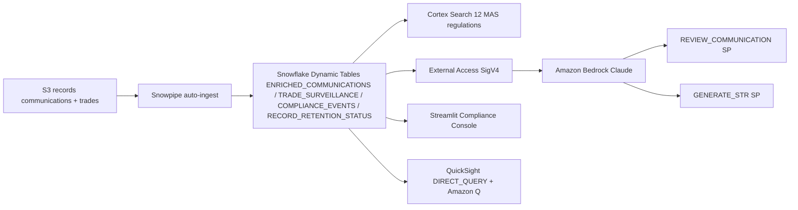

# MAS Regulatory Compliance & Record Keeping

Compliance surveillance platform for Singapore MAS-regulated banks — real-time communication monitoring, trade surveillance, Cortex Search over regulations, and AI-powered STR generation via Amazon Bedrock.

## Architecture

A MAS regulatory compliance and surveillance platform built on **Snowflake** (Snowpipe, Dynamic Tables, Cortex Search, External Access) and **AWS** (S3, Bedrock Claude, QuickSight + Amazon Q). Records auto-ingest from S3; Bedrock reviews communications and drafts STR narratives; QuickSight gives the compliance officer a direct-query lens.



## Snowflake Capabilities

| Capability | Implementation |
|-----------|---------------|
| Dynamic Tables | ENRICHED_COMMUNICATIONS / TRADE_SURVEILLANCE / COMPLIANCE_EVENTS / RECORD_RETENTION_STATUS |
| Snowpipe | Auto-ingest records and communications from S3 |
| Cortex Search | 12 MAS regulations and internal policies indexed |
| Cortex Agent | ComplianceAnalyst + RegulatorySearch tools |
| Semantic View | Structured analytics over communications, trades, events |
| Streamlit | Compliance Console with surveillance and STR generation |
| External Access | SigV4-signed calls to Amazon Bedrock for AI review |

## AWS Services

| Service | Role in Demo |
|---------|-------------|
| Amazon S3 | Landing zone for trade records and communications |
| Amazon Bedrock | Claude-powered communication review and STR generation |
| Amazon QuickSight | Executive compliance dashboard with direct query |
| Amazon Q | Natural language analytics for Head of Compliance |

## Personas

| Persona | Role | Key Questions |
|---------|------|---------------|
| **Compliance Officer** | Day-to-day surveillance and investigation | "Which communications are flagged?" "Generate an STR for this watchlist employee." |
| **Head of Compliance** | Strategic compliance oversight | "What's our event trend by severity?" "Are we meeting MAS retention requirements?" |

## Data

| Table | Rows | Description |
|-------|------|-------------|
| TRADE_RECORDS | 200 | SGX-listed instruments, 10 traders, 5 venues |
| COMMUNICATIONS | 200 | Emails/chats, ~45% flagged as suspicious |
| REGULATORY_FILINGS | 15 | STRs, FATCA, MAS Notices, audits |
| EMPLOYEE_WATCHLIST | 10 | Restricted traders with instrument restrictions |
| COMPLIANCE_DOCUMENTS | 12 | MAS Notices 610/626/637, internal policies |

## Build Instructions

### Prerequisites
- Snowflake account with ACCOUNTADMIN access
- Cortex AI enabled (ML Functions, Search, Agent)
- Warehouse: CORTEX (Medium)
- AWS CLI with Bedrock access (us-west-2)

### Deployment

```bash
snowsql -f snowflake/00_setup.sql
snowsql -f snowflake/01_integrations.sql
snowsql -f snowflake/02_raw_tables.sql
snowsql -f snowflake/03_curated.sql
```

### Streamlit App
```
FSI_REGULATORY_COMPLIANCE.APP.COMPLIANCE_CONSOLE_APP
```

## Build Modes

### Snowflake Only
Run the SQL scripts in `snowflake/` (skip `01_integrations.sql`) and deploy the Streamlit app from `streamlit/deploy/`. Uses Cortex AI instead of Bedrock, and Snowflake Intelligence instead of QuickSight.

### Full AWS + Snowflake
Run all SQL scripts including `01_integrations.sql`, deploy the main Streamlit app from `streamlit/`, then run the QuickSight setup from `quicksight/`.

## Business Impact

Industry research and Snowflake customer outcomes:
- **95% of traditional monitoring alerts** are false positives -- Industry benchmark
- **AI reduces false positive alerts** by 60-85% -- Danske Bank / HSBC case studies
- **FIS** (Snowflake customer): compliance data processed 20x faster on Snowflake, severity-1 incidents down 68% -- snowflake.com/customers
- **Non-compliance fines** totaled $8.86B in 2023 alone (57% YoY increase) -- LexisNexis
- **FIS** achieved 7x faster data loads and processes 1 billion transactions without issue on Snowflake -- snowflake.com/customers

## Key Demo Numbers

- **200 communications** monitored with ~45% flagged as suspicious
- **12 MAS regulations** indexed for semantic search
- **10 watchlist employees** with restricted instrument mappings
- **Bedrock STR generation** — AI drafts Suspicious Transaction Reports in seconds

## License

Apache 2.0 — See [LICENSE](LICENSE) for details.

This is a personal demo project and is not an official Snowflake offering. It comes with no support or warranty. Industry metrics cited are from publicly available third-party research and Snowflake customer stories; they represent reported outcomes and are not guarantees of results.
