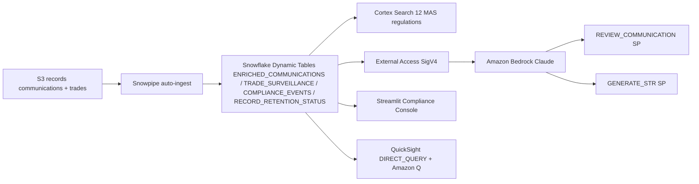

# MAS Regulatory Compliance & Record Keeping

Compliance surveillance platform for Singapore MAS-regulated banks — real-time communication monitoring, trade surveillance, Cortex Search over regulations, and AI-powered STR generation via Amazon Bedrock.

## Architecture

A MAS regulatory compliance and surveillance platform built on **Snowflake** (Snowpipe, Dynamic Tables, Cortex Search, External Access) and **AWS** (S3, Bedrock Claude, QuickSight + Amazon Q). Records auto-ingest from S3; Bedrock reviews communications and drafts STR narratives; QuickSight gives the compliance officer a direct-query lens.



## Personas

| Persona | Role | Key Questions |
|---------|------|---------------|
| **Compliance Officer** | Day-to-day surveillance and investigation | "Which communications are flagged?" "Generate an STR for this watchlist employee." |
| **Head of Compliance** | Strategic compliance oversight | "What's our event trend by severity?" "Are we meeting MAS retention requirements?" |

## Data

| Table | Rows | Description |
|-------|------|-------------|
| TRADE_RECORDS | 200 | SGX-listed instruments, 10 traders, 5 venues |
| COMMUNICATIONS | 200 | Emails/chats, ~45% flagged as suspicious |
| REGULATORY_FILINGS | 15 | STRs, FATCA, MAS Notices, audits |
| EMPLOYEE_WATCHLIST | 10 | Restricted traders with instrument restrictions |
| COMPLIANCE_DOCUMENTS | 12 | MAS Notices 610/626/637, internal policies |

## Build Instructions

### Prerequisites
- Snowflake account with ACCOUNTADMIN access
- Cortex AI enabled (ML Functions, Search, Agent)
- Warehouse: CORTEX (Medium)
- AWS CLI with Bedrock access (us-west-2)

### Deployment

```bash
snowsql -f snowflake/00_setup.sql
snowsql -f snowflake/01_integrations.sql
snowsql -f snowflake/02_raw_tables.sql
snowsql -f snowflake/03_curated.sql
```

### Streamlit App
```
FSI_REGULATORY_COMPLIANCE.APP.COMPLIANCE_CONSOLE_APP
```

## Key Demo Numbers

- **200 communications** monitored with ~45% flagged as suspicious
- **12 MAS regulations** indexed for semantic search
- **10 watchlist employees** with restricted instrument mappings
- **Bedrock STR generation** — AI drafts Suspicious Transaction Reports in seconds

## License

Apache 2.0 — See [LICENSE](LICENSE) for details.
