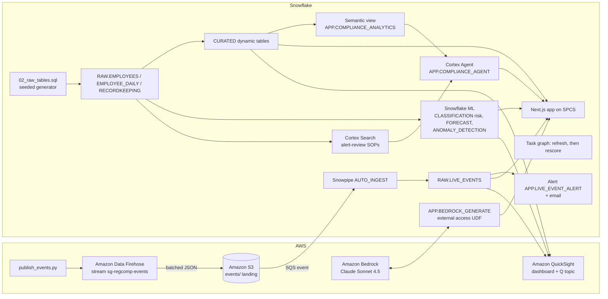

# Singapore Bank Conduct Surveillance and Record Keeping

End-to-end communication and trade surveillance for **40 front-office employees across 5 desks at a fictional Singapore bank** (Equities, FX, Rates, Credit, Wealth Advisory) using Snowflake, optionally with AWS: from a live flagged message or trade to a 7-day conduct-breach risk score, an alert email and an AI action memo for the Head of Compliance. The surveillance rules, SOPs and record-keeping policy are synthetic internal policies of the fictional bank; they are not regulatory text.

## Architecture

A conduct-surveillance pipeline built on **Snowflake** (Dynamic Tables, Snowflake ML, Cortex Search, Cortex Agent, Cortex AI_COMPLETE, SPCS) and, in the full build, **AWS** (Amazon Data Firehose, S3, Bedrock Claude, QuickSight + Amazon Q). Captured communication and trade events land in `RAW.LIVE_EVENTS`. Dynamic tables curate 90 days of employee-day history: alerts raised, confirmed breaches, escalated cases, alert precision, supervisory review compliance and communication-channel capture coverage. Snowflake ML scores 7-day conduct-breach risk per employee, forecasts bank-wide alert volume and flags after-hours messaging anomalies. A Cortex Agent answers questions with SOP citations, and an LLM drafts the compliance action memo.

Interactive diagrams (hover for object names): [Snowflake only](docs/architecture-snowflake.html) | [AWS + Snowflake](docs/architecture-aws.html). The app shows both on its Architecture & Data tab, the current build first. Regenerate them with `python3 docs/build_architecture.py`.


```mermaid
flowchart LR
    subgraph AWS
      SIM[publish_events.py] --> FH[Amazon Data Firehose<br/>stream sg-regcomp-events]
      FH -->|batched JSON| S3[(Amazon S3<br/>events/ landing)]
      BR[Amazon Bedrock<br/>Claude Sonnet 4.5]
      QS[Amazon QuickSight<br/>dashboard + Q topic]
    end
    subgraph Snowflake
      S3 -->|SQS event| PIPE[Snowpipe AUTO_INGEST] --> LIVE[RAW.LIVE_EVENTS]
      GEN[02_raw_tables.sql<br/>seeded generator] --> RAW[RAW.EMPLOYEES / EMPLOYEE_DAILY / RECORDKEEPING]
      RAW --> DT[CURATED dynamic tables]
      RAW --> ML[Snowflake ML<br/>CLASSIFICATION risk, FORECAST,<br/>ANOMALY_DETECTION]
      DT --> SV[Semantic view<br/>APP.COMPLIANCE_ANALYTICS]
      RAW --> CS[Cortex Search<br/>alert-review SOPs]
      SV --> AG[Cortex Agent<br/>APP.COMPLIANCE_AGENT]
      CS --> AG
      LIVE --> AL[Alert APP.LIVE_EVENT_ALERT<br/>+ email]
      UDF[APP.BEDROCK_GENERATE<br/>external access UDF]
      TK[Task graph: refresh, then rescore]
      APP[Next.js app on SPCS]
    end
    BR <--> UDF
    DT --> APP
    ML --> APP
    LIVE --> APP
    AG --> APP
    UDF --> APP
    DT --> QS
    ML --> QS
    LIVE --> QS
```

The Snowflake-only build drops the AWS subgraph: `APP.SIMULATE_EVENTS` writes to `RAW.LIVE_EVENTS`, and the app calls Cortex `AI_COMPLETE` instead of the Bedrock UDF.

## Snowflake Capabilities

| Capability | Implementation |
|-----------|---------------|
| Dynamic Tables | `CURATED.KPI_SUMMARY`, `PERFORMANCE_SUMMARY`, `RULE_SUMMARY`, `TREND_ANALYSIS` from the RAW tables |
| Snowflake ML | CLASSIFICATION 7-day conduct-breach risk (`ML.BREACH_RISK_SCORES`), 14-day alert-volume FORECAST, after-hours messaging ANOMALY_DETECTION |
| Cortex Search | 14 synthetic alert-review SOPs (one per desk and detection rule) in `SEARCH.SURVEILLANCE_SOP_SEARCH` |
| Semantic View | `APP.COMPLIANCE_ANALYTICS` over employees, detection rules, daily totals and risk |
| Cortex Agent | `APP.COMPLIANCE_AGENT`: Cortex Analyst over the semantic view plus Cortex Search for SOP citations |
| Cortex AI | `AI_COMPLETE('claude-sonnet-4-5')` for grounded answers, and for the action memo in the Snowflake-only build |
| Alerts + Tasks | `APP.LIVE_EVENT_ALERT` logs ALERT events and sends email; task graph `TASK_REFRESH_CURATED`, then `TASK_RESCORE_RISK` |
| Snowpark Container Services | Next.js app `APP.SG_REGCOMP_APP` with 6 tabs: Executive Cockpit, Predictive, Record Keeping, Live Surveillance, Ask AI, Architecture & Data |
| Snowpipe | `RAW.LIVE_EVENTS_PIPE` AUTO_INGEST from S3 (AWS build only) |

## AWS Services

Used only in the AWS + Snowflake build.

| Service | Role in Demo |
|---------|-------------|
| Amazon Data Firehose | Direct PUT stream `sg-regcomp-events` receives simulated communication and trade events and writes batches to S3 |
| Amazon S3 | Landing bucket (`events/`). An event notification goes to the Snowpipe SQS queue |
| Amazon Bedrock | Claude Sonnet 4.5 writes the action memo, called from Snowflake through an external-access UDF |
| Amazon QuickSight | DIRECT_QUERY executive dashboard over Snowflake (daily alerts, confirmed breaches by employee, conduct-breach risk) |
| Amazon Q | Natural-language questions over the QuickSight topic `sg-regcomp-topic` |
| AWS IAM | Least-privilege roles for S3, Firehose and Bedrock |

## Personas

These personas are fictional.

| Persona | Role | Key Questions |
|---------|------|---------------|
| **Rachel Tan** | Head of Compliance | "What is our alert precision?" "Which detection rules produce the most confirmed breaches?" "Are supervisory reviews and record capture keeping up?" |
| **Marcus Lee** | Surveillance Analyst | "Which employees are high risk this week, and which SOP applies?" |

## Data

All data is synthetic and seeded, so every rebuild reproduces it. The bank, employees and names are fictional.

| Table | Rows | Description |
|-------|------|-------------|
| RAW.EMPLOYEES | 40 | Front-office employees across 5 desks and 5 seniority levels, with watchlist flag and tenure |
| RAW.EMPLOYEE_DAILY | 3,600 | Daily employee observations over 90 days: messages captured, trades, notional (SGD), alerts, confirmed breaches, escalated cases, detection rule, supervisory review, after-hours messaging share and flagged-term rate |
| RAW.RECORDKEEPING | 40 | Required, captured and pending communication channels per employee |
| SEARCH.SURVEILLANCE_DOCS | 14 | Synthetic alert-review SOPs indexed for Cortex Search |
| RAW.LIVE_EVENTS | Grows during the demo | Live surveillance events from Firehose (AWS build) or `APP.SIMULATE_EVENTS` (Snowflake-only build) |
| ML.BREACH_RISK_SCORES | 40 | 7-day conduct-breach probability and risk band per employee |

## Build Instructions

### Prerequisites
- Snowflake account with ACCOUNTADMIN access, and Cortex AI enabled (AI_COMPLETE, Search, Agent).
- An X-Small warehouse with auto-suspend at or below 120 s, and an existing SPCS compute pool.
- Python 3.11+, `snowflake-connector-python`, Node.js 22+, Docker and the `snow` CLI.
- App image: run `snow spcs image-registry login`, then build and push `sg-regcomp-app:v1` to the database's `APP.IMAGES` repository (see the header of `snowflake/07_deploy_app.sql`).
- AWS build only: `boto3`, AWS credentials for the target account (us-west-2) with Bedrock access, and QuickSight Enterprise.

### SPCS App
```
<DATABASE>.APP.SG_REGCOMP_APP
```

### Tests
```bash
python -m pytest aws snowflake quicksight
```

For a local run, put `SNOWFLAKE_ACCOUNT`, `SNOWFLAKE_USER`, `SNOWFLAKE_DATABASE`, `SNOWFLAKE_WAREHOUSE`, `SNOWFLAKE_AUTHENTICATOR=PROGRAMMATIC_ACCESS_TOKEN`, `SNOWFLAKE_TOKEN` and `DEMO_PLATFORM` in the environment, then run `npm --prefix app run build && npm --prefix app start`.

## Build Modes

Both modes share the same core. They differ in three places, and the app's `DEMO_PLATFORM` setting (in its SPCS spec) switches the memo provider and the Live Surveillance tab.

| Layer | Snowflake Only | Full AWS + Snowflake |
|---|---|---|
| Live events | `CALL APP.SIMULATE_EVENTS(n)` inserts simulated communication and trade events into `RAW.LIVE_EVENTS`. This simulates an event feed; it is not Snowpipe Streaming | `aws/publish_events.py` to Amazon Data Firehose, then S3, SQS and Snowpipe AUTO_INGEST |
| Action memo | Cortex `AI_COMPLETE('claude-sonnet-4-5')` | Amazon Bedrock Claude Sonnet 4.5 through `APP.BEDROCK_GENERATE` |
| BI and natural-language questions | The SPCS app is the dashboard; questions go to the Cortex Agent | Also a QuickSight dashboard and an Amazon Q topic |
| App setting | `DEMO_PLATFORM: snowflake` | `DEMO_PLATFORM: aws` |

### Snowflake Only

```bash
# 1. Core data and dynamic tables (guarded: new isolated database only)
python snowflake/run_core.py --database SINGAPORE_REGCOMP_SNOWFLAKE --warehouse <XS_WAREHOUSE> --connection <CONNECTION> --apply
# 2. Native event feed, ML, search, semantic view, agent, alert and task graph
python snowflake/run_intelligence.py --database SINGAPORE_REGCOMP_SNOWFLAKE --platform snowflake --warehouse <XS_WAREHOUSE> --connection <CONNECTION> --alert-email you@example.com
# 3. App on SPCS with DEMO_PLATFORM=snowflake (push the image first)
python snowflake/run_intelligence.py --database SINGAPORE_REGCOMP_SNOWFLAKE --platform snowflake --warehouse <XS_WAREHOUSE> --connection <CONNECTION> --alert-email you@example.com --files 07_deploy_app.sql --compute-pool <COMPUTE_POOL>
```

During the demo:
- Run `CALL APP.SIMULATE_EVENTS(20)` to add live surveillance events. For a continuous feed, run `ALTER TASK APP.TASK_SIMULATE_EVENTS RESUME`, and `SUSPEND` it afterwards.
- Run `EXECUTE ALERT APP.LIVE_EVENT_ALERT` to raise the alert email.
- Run `EXECUTE TASK APP.TASK_REFRESH_CURATED` to refresh the curated tables and rescore risk.

Afterwards, drop the database or run `ALTER SERVICE APP.SG_REGCOMP_APP SUSPEND`.

### Full AWS + Snowflake

```bash
# 1. Core data and dynamic tables (guarded: new isolated database only)
python snowflake/run_core.py --database SINGAPORE_REGCOMP_AWS --warehouse <XS_WAREHOUSE> --connection <CONNECTION> --apply
# 2. AWS ingestion and Bedrock (dry run first, then --apply)
python aws/setup_aws.py --database SINGAPORE_REGCOMP_AWS --account <AWS_ACCOUNT_ID> --connection <CONNECTION> --apply
# 3. ML, search, semantic view, agent, alert and task graph
python snowflake/run_intelligence.py --database SINGAPORE_REGCOMP_AWS --platform aws --warehouse <XS_WAREHOUSE> --connection <CONNECTION> --alert-email you@example.com
# 4. App on SPCS with DEMO_PLATFORM=aws (push the image first)
python snowflake/run_intelligence.py --database SINGAPORE_REGCOMP_AWS --platform aws --warehouse <XS_WAREHOUSE> --connection <CONNECTION> --alert-email you@example.com --files 07_deploy_app.sql --compute-pool <COMPUTE_POOL>
# 5. QuickSight dashboard and Q topic (needs an existing Snowflake data source)
python quicksight/build_dashboards.py --database SINGAPORE_REGCOMP_AWS --account <AWS_ACCOUNT_ID> --principal-arn <QUICKSIGHT_USER_ARN> --data-source-arn <DATA_SOURCE_ARN> --prefix sg-regcomp --apply --update --with-topic
```

QuickSight objects must be shared with the QuickSight user who signs in (`--principal-arn`); otherwise the console shows nothing.

During the demo:
- Run `python aws/publish_events.py --count 20` to send live surveillance events. Firehose buffers for up to 60 seconds before writing to S3.
- Run `EXECUTE ALERT APP.LIVE_EVENT_ALERT` to raise the alert email.
- Run `EXECUTE TASK APP.TASK_REFRESH_CURATED` to refresh the curated tables and rescore risk.

Afterwards, `python aws/teardown_aws.py --database SINGAPORE_REGCOMP_AWS --account <AWS_ACCOUNT_ID> --connection <CONNECTION> --apply` removes the AWS resources and the account-level Bedrock external-access and S3 storage integrations. It leaves the email integration `SG_REGCOMP_EMAIL_INT`, which the Snowflake-only build also uses.

## Business Impact

Industry research and Snowflake customer outcomes:
- **98% of financial institutions** reported an increase in financial crime compliance costs -- [LexisNexis Risk Solutions and Forrester Consulting, True Cost of Financial Crime Compliance Global Study, 2023](https://risk.lexisnexis.com/insights-resources/research/true-cost-of-financial-crime-compliance-study-global-report)
- **FIS** (Snowflake customer) rebuilt its capital markets Compliance Suite, which covers communications surveillance, anti-money laundering and regulatory reporting, on Snowflake: 2.5x faster execution using less than 20% of the compute power, compliance data processed up to 20 times faster, and severity 1 and 2 incidents down 68% -- [Snowflake customer story: FIS](https://www.snowflake.com/en/customers/all-customers/case-study/fis/)

## Key Demo Numbers

These figures are synthetic and come from the seeded demo data. Forecast and anomaly figures can shift slightly with the build day.

- **40 employees**, 3,600 employee-days over 90 days, across 5 desks and 5 seniority levels (9 on the conduct watchlist); 357,293 communications captured and SGD 203,581 M notional surveilled
- **574 alerts** raised and **165 confirmed** as breaches, so alert precision is 28.7%; **73 cases escalated**
- **Insider-information keyword** produces the most confirmed breaches (46 of 165); the 25 market-wide news event alerts are never confirmed
- **Conduct-breach model** out-of-time holdout: precision 0.37, recall 0.22 at a 0.5 threshold, against a 0.22 base rate. Four employees are high risk; the top employee is EMP-0022, at 97.0%
- **14-day alert forecast** with prediction intervals; **24 of 640** employee-days flagged as after-hours messaging anomalies
- **Supervisory review compliance 82.8%**, record capture coverage 71.7%, with 12 channels pending capture
- **14 SOPs** indexed for Cortex Search and cited by ID in agent answers

## License

Apache 2.0 — See [LICENSE](LICENSE) for details.

This is a personal demo project and is not an official Snowflake offering. It comes with no support or warranty. Industry metrics cited are from publicly available third-party research and Snowflake customer stories; they represent reported outcomes and are not guarantees of results.
